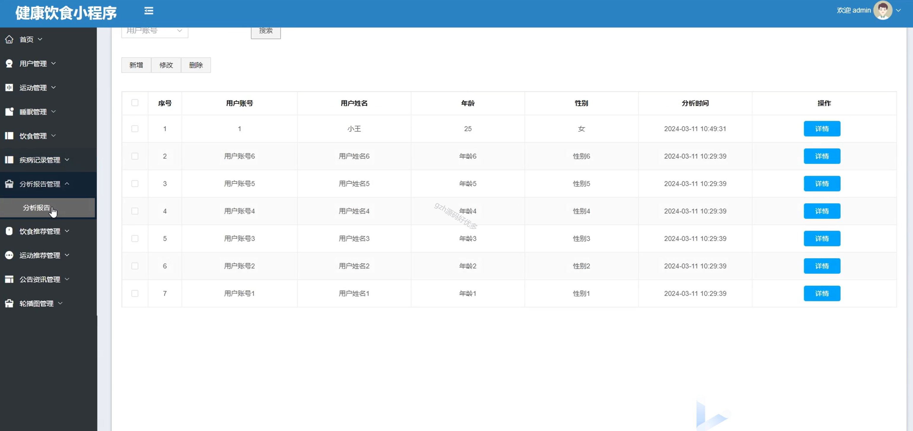

# mpweixinA064
mpweixinA064健康饮食微信小程序（Vue3+原生+unipp）
 
## 查看主页获取源码

### 一、作品包含

源码+数据库+全套环境和工具资源+部署教程

### 二、项目技术

前端技术：Html、Css、Js、Vue2.0、Element-ui、Uniapp

数据库：MySQL

后端技术：Java、Spring Boot、MyBatis

  

### 三、运行环境

开发工具：IDEA/eclipse + HBuilderX + 微信开发者工具

数据库：MySQL5.7（最低要5.7版本）

数据库管理工具：Navicat10以上版本

环境配置软件： JDK1.8+Maven3.6.3

前端Nodejs：16

### 四、项目介绍
项目编号：mpweixinA064

本项目是一个基于Spring Boot和微信小程序的健康饮食小程序。该平台致力于为用户提供科学、营养的饮食建议，帮助用户管理健康饮食习惯。用户可以通过小程序查看每日推荐的健康食谱、营养成分分析、以及个性化的饮食计划。系统支持食材购买链接，用户可以一键购买所需食材，方便快捷。后台管理系统基于Spring Boot框架，支持动态更新食谱、分析用户饮食数据并生成健康报告。平台还提供饮食记录功能，用户可以记录每日的饮食情况，系统根据记录给出健康评估和改进建议。通过数据分析和智能推荐，帮助用户实现健康饮食、维持良好的生活方式。该项目提供了全面的饮食健康管理服务，提升了用户的饮食质量和生活健康水平。

### 五、运行截图

  
